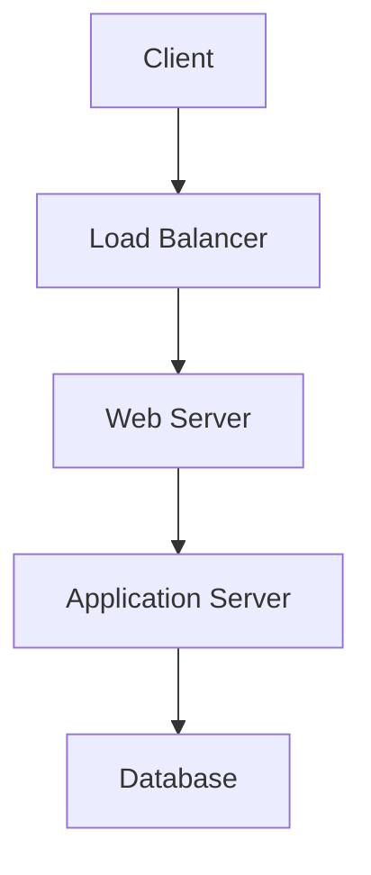

# System Architecture Security Document
Version: 1.0.0
Status: Draft
Last Updated: [Date]

## System Overview
### Architecture Diagram

## Component Analysis
### Frontend
- Framework: [Name]
- Security Controls:
  - CSP Configuration
  - XSS Protection
  - CSRF Protection

### Backend
- Language: [Name]
- Framework: [Name]
- Security Controls:
  - Authentication
  - Authorization
  - Input Validation

### Database
- Type: [Name]
- Security Controls:
  - Access Control
  - Encryption
  - Backup Strategy

### Infrastructure
- Cloud Provider: [Name]
- Network Security:
  - Firewall Rules
  - VPC Configuration
  - WAF Settings

## Security Boundaries
### Trust Zones
1. Public Zone
   - Components:
   - Security Controls:

2. Private Zone
   - Components:
   - Security Controls:

## Data Flow
### Critical Paths
1. Authentication Flow
   - Steps:
   - Security Controls:

2. Data Processing Flow
   - Steps:
   - Security Controls:

## Change Log
| Date | Change | Approved By |
|------|---------|------------|
| [Date] | Initial Version | [Name] |

## Approval
- Reviewed By: [Name]
- Approved By: [Name]
- Date: [Date] 